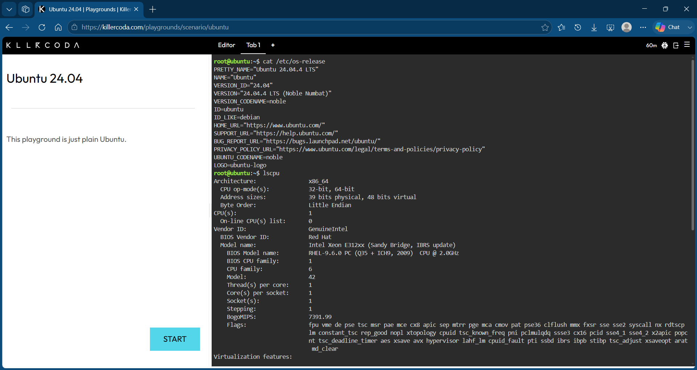

## Checkpoint 7 – Linux Cloud Migration

### Linux Server Information

- *Operating System:* Ubuntu 24.04.4 LTS
- *CPU:* Intel Xeon E312xx
- *CPU Count:* 1
- *Memory:* 1.9 GiB RAM
- *Disk Space:* 19 GB total
- *Available Disk Space:* 13 GB

### Cloud Services

| Cloud Platform | Service | Purpose |
|---|---|---|
| AWS | Amazon EC2 | Host the Ubuntu Linux virtual machine |
| Microsoft Azure | Azure Virtual Machines | Host the Ubuntu Linux virtual machine |
| Google Cloud | Compute Engine | Host the Ubuntu Linux virtual machine |

### Explanation

If this Linux server were migrated to the cloud, Amazon EC2, Azure Virtual Machines, or Compute Engine could host the Ubuntu Linux server. These services provide virtual machines that can run Linux operating systems. The best choice would depend on the company's requirements, budget, and preferred cloud provider.

### Screenshot

Figure 1. Linux system information collected using KillerCoda.
