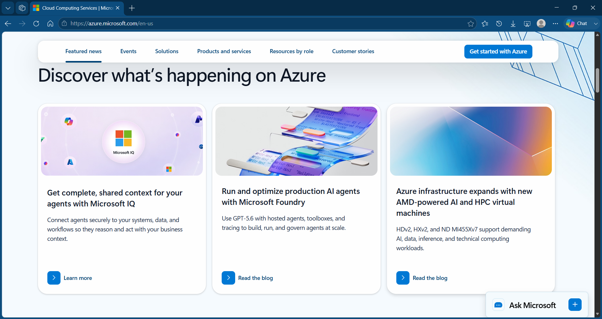

# Azure Research

## Brief Overview

Microsoft Azure is a cloud computing platform developed by Microsoft. It provides services for computing, storage, databases, networking, artificial intelligence, and other cloud needs (Microsoft, n.d.-a).

## Global Infrastructure

Azure has a global infrastructure made up of regions and datacenters in different geographic locations. This infrastructure helps organizations meet requirements related to performance, data residency, and availability (Microsoft, n.d.-b).

## Cloud Management Console

The Azure portal is a web-based interface used to create, manage, and monitor Azure resources. Users can manage services such as virtual machines, databases, and storage through the portal (Microsoft, n.d.-c).

## Four Core Services

### 1. Azure Virtual Machines

Azure Virtual Machines provides virtual computing resources that can run Windows or Linux applications in the cloud (Microsoft, n.d.-a).

### 2. Azure Blob Storage

Azure Blob Storage is an object storage service used to store large amounts of unstructured data such as files and backups (Microsoft, n.d.-a).

### 3. Azure SQL Database

Azure SQL Database is a managed relational database service that allows organizations to run SQL databases in the cloud (Microsoft, n.d.-a).

### 4. Microsoft Entra ID

Microsoft Entra ID is a cloud-based identity and access management service used to manage users and access to applications and resources (Microsoft, n.d.-a).

## Three Advantages

### 1. Global Infrastructure

Azure provides a large global infrastructure with regions and datacenters in many locations around the world (Microsoft, n.d.-b).

### 2. Microsoft Integration

Azure works well with Microsoft technologies. This makes it useful for organizations that already use Microsoft products and systems (Microsoft, n.d.-a).

### 3. Scalability

Azure allows organizations to scale their cloud resources based on their workload and requirements.

## Typical Enterprise Use Cases

Azure can be used by enterprises to host applications, run virtual machines, store data, manage databases, and support business systems. It can also be useful for organizations already using Microsoft technologies (Microsoft, n.d.-a).

## Screenshot

Figure 1. Official Microsoft Azure website screenshot.

## References

- Microsoft. (n.d.-a). Azure products. Microsoft Azure. https://azure.microsoft.com/en-us/products/
- Microsoft. (n.d.-b). Azure global infrastructure. Microsoft Azure. https://azure.microsoft.com/en-us/explore/global-infrastructure/
- Microsoft. (n.d.-c). What is the Azure portal? Microsoft Learn. https://learn.microsoft.com/en-us/azure/azure-portal/azure-portal-overview
- Microsoft. (n.d.-d). Azure documentation. Microsoft Learn. https://learn.microsoft.com/en-us/azure/
