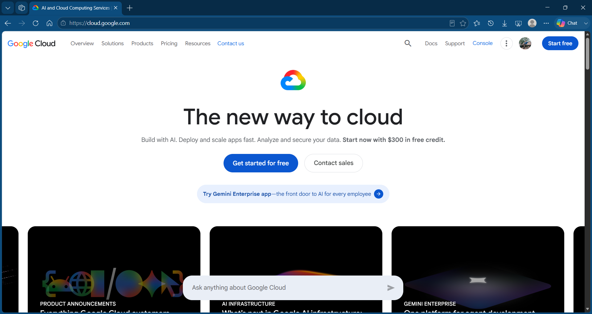

# GCP Research

## Brief Overview

Google Cloud is a cloud computing platform provided by Google. It provides services for computing, storage, databases, networking, data analytics, artificial intelligence, and machine learning (Google Cloud, n.d.-a).

## Global Infrastructure

Google Cloud uses regions and zones as part of its global infrastructure. Regions are geographic areas, while zones are deployment areas within regions. These locations help organizations deploy applications based on their performance and availability requirements (Google Cloud, n.d.-b).

## Cloud Management Console

The Google Cloud console is a web-based interface used to create, manage, and monitor Google Cloud resources. Users can manage cloud services and resources through projects (Google Cloud, n.d.-a).

## Four Core Services

### 1. Compute Engine

Compute Engine provides virtual machines that organizations can use to run applications and workloads (Google Cloud, n.d.-c).

### 2. Cloud Storage

Cloud Storage is an object storage service used to store and access data in Google Cloud (Google Cloud, n.d.-a).

### 3. Cloud SQL

Cloud SQL is a managed relational database service for databases such as MySQL, PostgreSQL, and SQL Server (Google Cloud, n.d.-a).

### 4. Google Kubernetes Engine

Google Kubernetes Engine (GKE) is a managed Kubernetes service used to deploy and manage containerized applications (Google Cloud, n.d.-a).

## Three Advantages

### 1. Global Infrastructure

Google Cloud provides regions and zones in different geographic locations, allowing organizations to choose locations based on their needs (Google Cloud, n.d.-b).

### 2. AI and Data Services

Google Cloud provides services for artificial intelligence, machine learning, and data analytics (Google Cloud, n.d.-a).

### 3. Scalability

Google Cloud allows organizations to scale their resources according to their workloads and requirements.

## Typical Enterprise Use Cases

Google Cloud can be used by enterprises to host applications, run virtual machines, store data, manage databases, deploy containerized applications, and develop AI and machine learning solutions (Google Cloud, n.d.-a).

## Screenshot

Figure 1. Official Google Cloud website screenshot.

## References

- Google Cloud. (n.d.-a). Google Cloud overview. https://docs.cloud.google.com/docs/overview
- Google Cloud. (n.d.-b). Cloud locations. https://cloud.google.com/about/locations
- Google Cloud. (n.d.-c). Compute Engine overview. https://docs.cloud.google.com/compute/docs/overview
- Google Cloud. (n.d.-d). Google Cloud products. https://cloud.google.com/products
